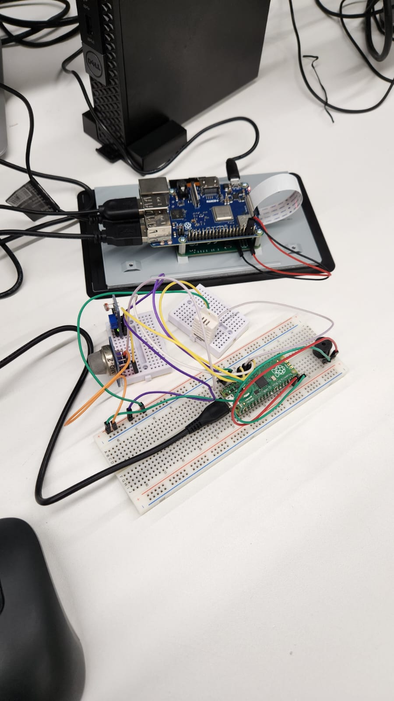
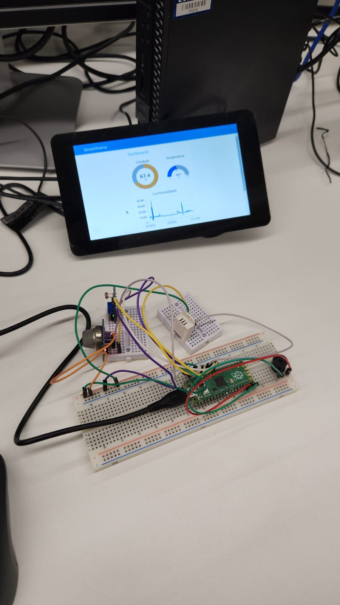
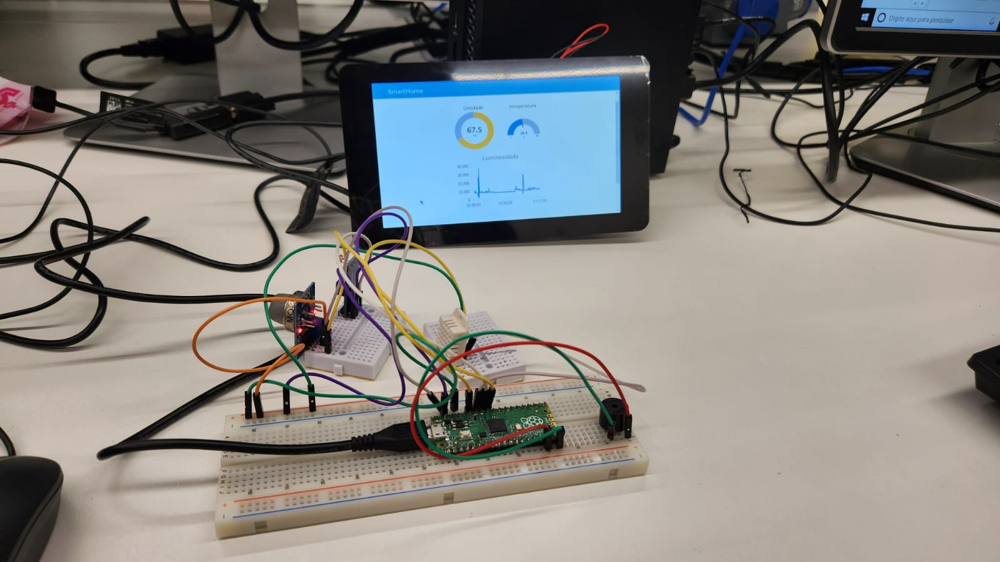
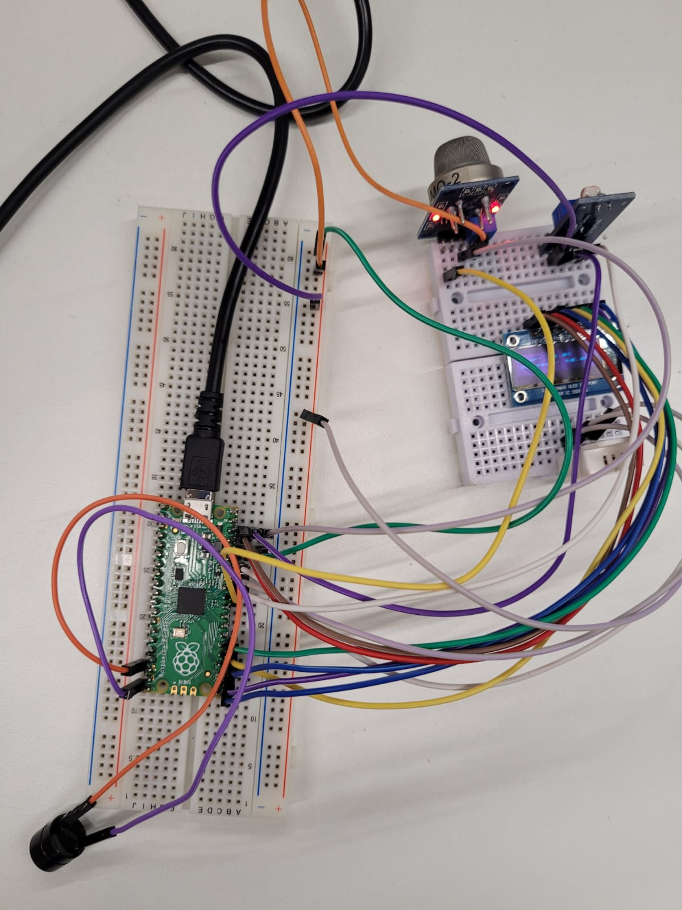

# Trabalho T2 EEN251 - SmartHome

## Integrantes do grupo
Guilherme Samuel de Souza Barbosa - RA 19.00012-0

Igor Eiki Ferreira Kubota - RA 19.02466-5

Gustavo Consoleti Ramirez de Souza - RA: 19.00715-9

[Link do vídeo do projeto em execução](https://www.youtube.com/watch?v=4Dw4A4rD4js)

### Circuito do Pi

### Dashboard

## Projeto

Nosso projeto consiste em um sistema que monitora sensores de temperatura, luminosidade, gás e umidade e mostra esses dados em um Dashboard interativo, feito de NodeRed, com output em um display Touchscreen.

Foi utilizado os seguintes componentes eletrônicos:

• T1 - Coleta dos dados
- Raspberry Pi Pico
- Buzzer
- DTH11 - Sensor de Temperatura e Pressão
- LDR - Sensor de Luminosidade
- MQ2 - Sensor de Gás
- Painel OLED

[Link do vídeo do projeto em execução](https://youtu.be/hk8b_z8nRYc)

• T2 - Dashboard
- Raspberry Pi
- 7" Touchscreen Display

### Vista superior do circuito montado

### Imagens da caixa criada para suportar o circuito

